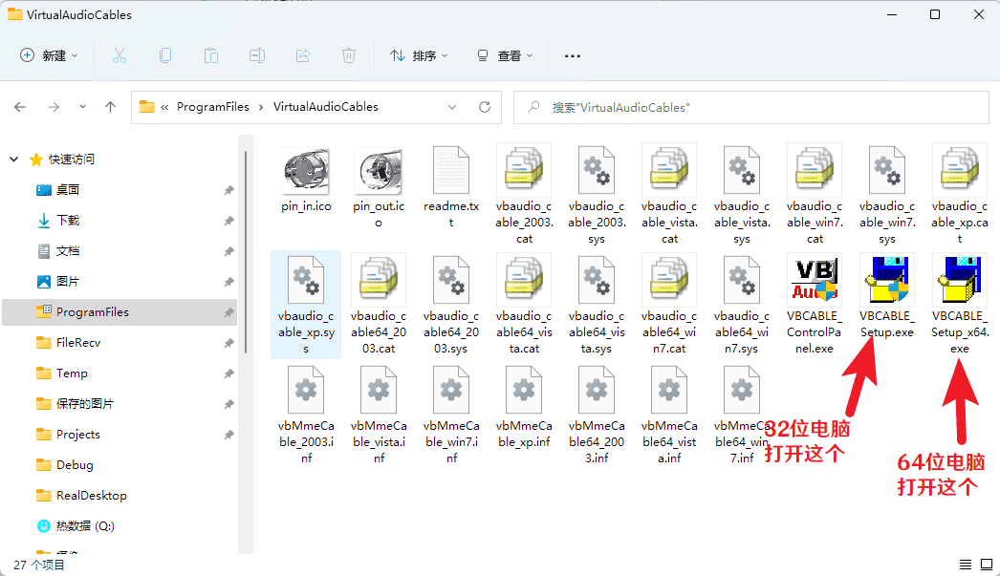
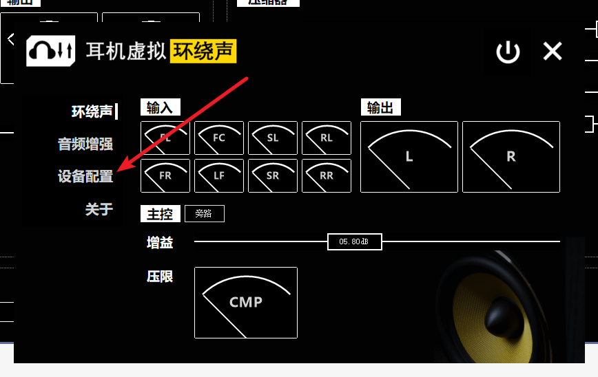
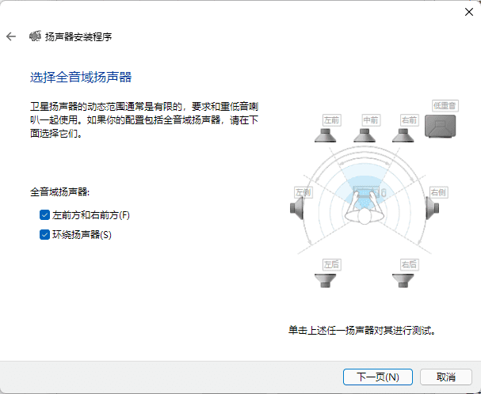

# 安装指南

使用本软件时，需要先安装虚拟音频设备。这里以**VB Audio Cable**举例

## VB Audio Cable安装

### 1. 下载VB Audio Cable

你可以通过两种方法下载VB Audio Cable:

官网  [https://vb-audio.com/Cable/index.htm](https://vb-audio.com/Cable/index.htm)

网盘：  [https://zyfdroid.lanzoul.com/b065zrvte](https://zyfdroid.lanzoul.com/b065zrvte)   密码:5fpu

### 2. 安装VB Audio Cable

解压下载到的 `VBCABLE_Driver_Pack43.zip`

打开对应程序

安装完成后重启电脑

### 3. 配置VB Audio Cable

重启电脑后，打开配置向导

点击 打开音频控制面板

如果能看到一个叫Cable Input的设备，代表安装成功。接下来选中这个设备，然后点击 配置

选择 7.1环绕，点击下一步

全部勾选，全部下一步

配置完成后，即可使用耳机虚拟环绕声软件。
